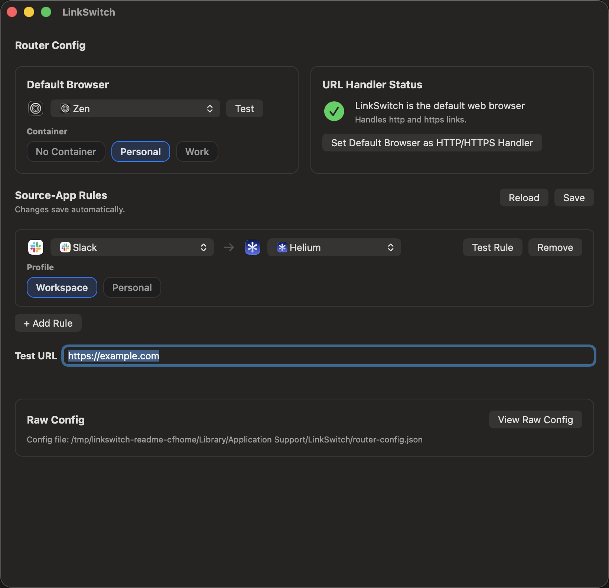

# LinkSwitch

**Route links to the right browser, automatically.**

Didn't wanna pay for Velja - so made my own equivalent. Added decent support for all Chromium-like browsers, and specifically tested for Helium, Google Chrome, Zen -- as those are the ones that I use. If you don't find your browser's profiles supported - feel free to fork and add a PR. 

Discovers all browsers on your mac, and allows you to route to any using the URL picker. A menubar native app, so it doesn't bloat your dock. Configurable as much as you need for this specific task - no other batteries included.

LinkSwitch is a native macOS URL handler that intercepts `http` and `https` links and opens them in the browser of your choosing — based on which app opened the link. Send Slack links to your work browser profile, let everything else go to your personal default. No manual copy-paste, no chooser popup.

Rules and your default browser are stored in an explicit config file. LinkSwitch never silently infers browser preferences from the system.

Built with Swift and AppKit.

## How it works

1. Set LinkSwitch as your default browser in macOS System Settings.
2. Open Preferences, pick your default browser, and add per-source rules (e.g. Slack → Helium with a specific profile).
3. Every link you open routes automatically from there.

## Screenshots

## Features

- **Source-based routing** — rules match on the bundle ID of the app that opened the link
- **Profile support** — route to specific Chromium-style work profiles or Firefox/Zen profiles
- **Zen container handoff** — optional `ext+container:` routing to a named container ([caveats](docs/zen-container-handoff.md))
- **Menu bar app** — lightweight, always available, out of your way
- **Explicit config** — plain config file, no magic inference

Zen container routing uses the Firefox ecosystem’s `ext+container:` handoff, not a built-in Zen API. If you use it, read the [short caveat doc](docs/zen-container-handoff.md) first. No Container works best for now (opens in whatever container window you have open)

## Project structure

- `App/` — app lifecycle and UI
- `Core/` — routing, config, launch
- `Tests/` — unit tests
- `Fixtures/` — harness apps
